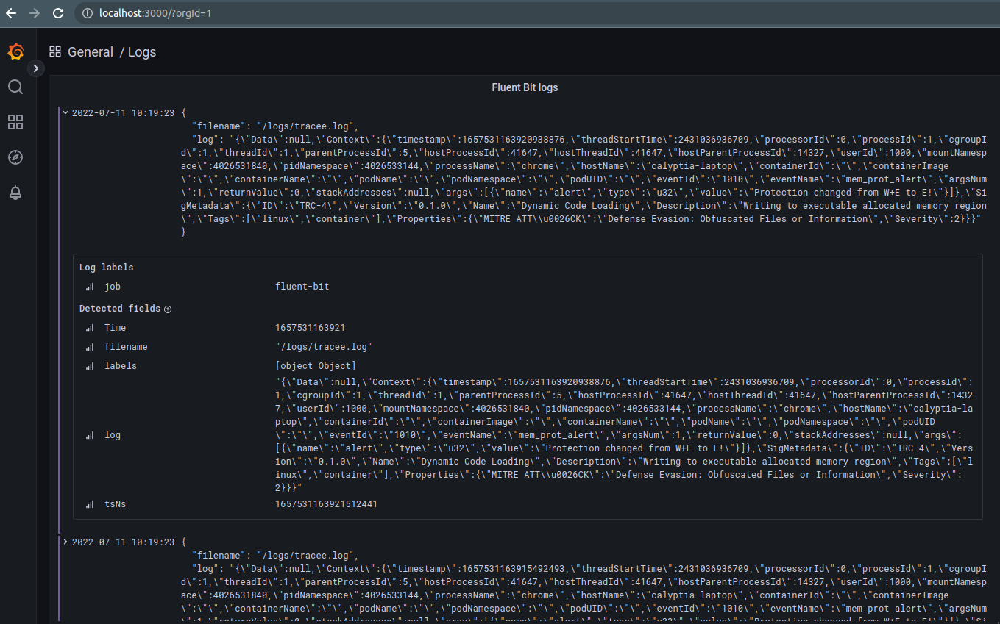

# fluent-bit-tracee-integration

Example of providing eBPF output from Tracee to any Fluent Bit endpoint

## Usage

Running on Ubuntu 20.04 with `docker` and `docker-compose` installed:

```shell
git clone https://github.com/patrick-stephens/fluent-bit-tracee-integration.git
cd fluent-bit-tracee-integration
docker-compose up
```

The whole stack should spin up and in a minute or so Grafana should start receiving data, you can log in as `admin:admin` at [`http://localhost:3000`](http://localhost:3000/).



I would also suggest running a fresh stack each time:

```shell
docker-compose up --force-recreate --always-recreate-deps --abort-on-container-exit --remove-orphans
```

## Other endpoints

See <https://calyptia.com/2022/03/23/how-to-send-openshift-logs-and-metrics-to-datadog-elastic-and-grafana/> for a post on how to configure Fluent Bit to send to Grafana Cloud, Elastic Cloud, Datadog, etc. so you can report your eBPF monitoring there.
